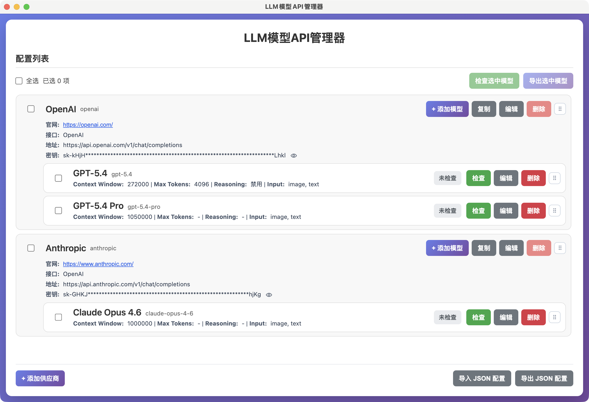
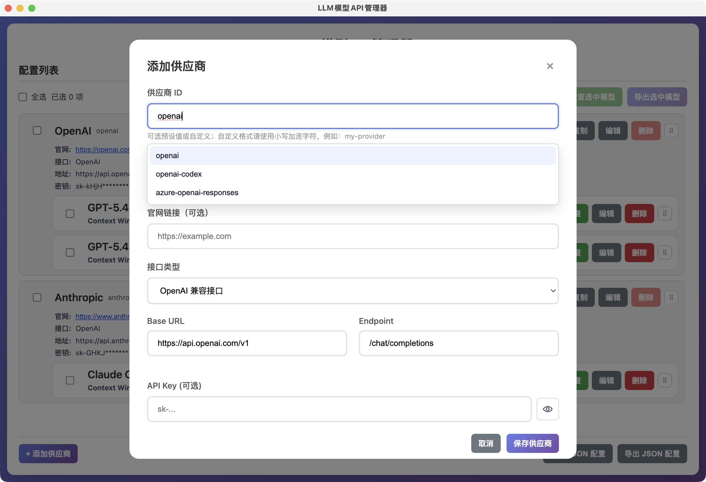
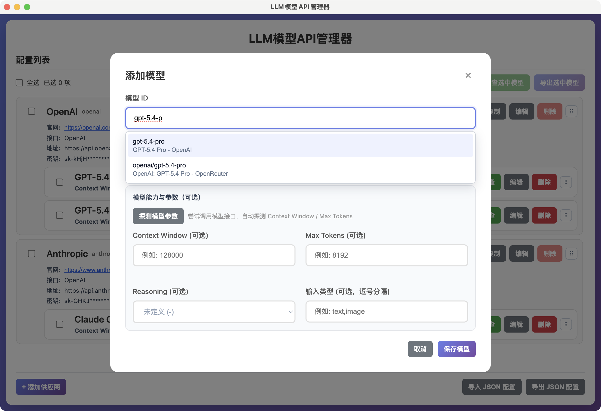
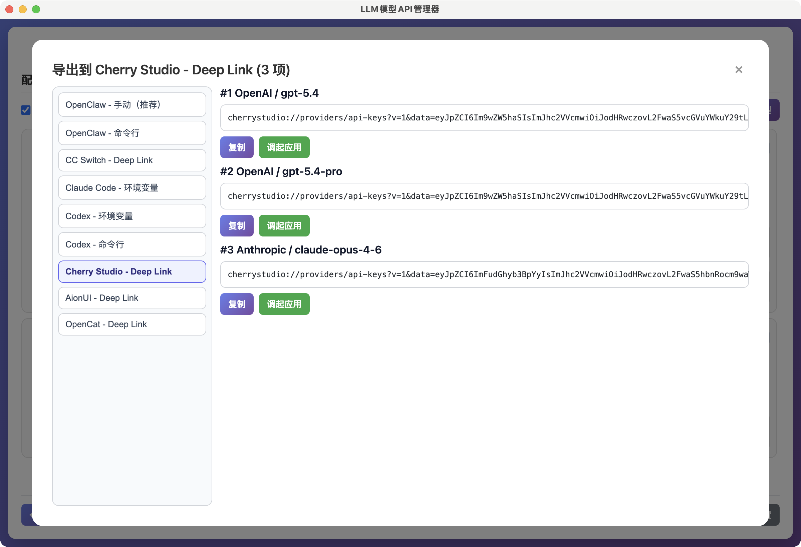

# LLM 模型 API 管理器

一个用于管理 Provider / Model 配置、检查模型可用性并导出到多种工具的 Electron 桌面应用。当前支持 OpenAI 兼容接口与 Anthropic 接口。

## 说明

本项目代码主要由 AI 实现，未经过严格完整测试。如发现功能遗漏、兼容性问题或其他错误，欢迎提交 [Issue](../../issues) 或 [PR](../../pulls)。

## 主要功能

- 管理多个供应商和模型（新增、编辑、删除、复制、排序）
- 支持模型可用性检查和批量检查
- 支持模型参数探测（如 Context Window、Max Tokens）
- 支持一键导出到多个常用 AI 工具
- 支持导入/导出 JSON 配置，便于备份和迁移
- 本地保存配置，离线可用

供应商（Provider）和模型（Model）管理：



添加供应商（Provider）：



添加模型（Model）：



导出到常用AI App：



## 下载安装包

直接使用应用，可前往 [GitHub Releases](https://github.com/jzj1993/llm-model-manager/releases) 下载对应平台安装包。

## 使用流程

1. 点击 `+ 添加供应商`，填写 `供应商 ID`、`Base URL`、`Endpoint`（可选 API Key / 官网）。
2. 在供应商下添加模型（可使用模型预设自动填充参数）。
3. 对单个模型点击 `检查`，或在顶部勾选后点击 `检查选中模型`。
4. 需要导出时，勾选模型并点击 `导出选中模型`，选择目标格式后复制或执行。
5. 需要跨设备/备份配置时，使用右下角 `导出 JSON 配置`。
6. 导入配置时点击右下角 `导入 JSON 配置`。

## JSON 导入冲突处理

当“当前已有配置”且“导入文件也包含配置”时，应用会弹出选择框：

- `合并导入`：按 `provider.id` 合并；同一 Provider 内按 `model.id` 合并（同 ID 以导入内容为准）
- `覆盖导入`：使用导入文件替换当前全部配置
- `取消`：不执行本次导入

## 导出目标（当前内置）

- OpenClaw（手动 / 命令行）
- CC Switch（命令行 / Deep Link）
- Claude Code（命令行）
- Codex（命令行）
- Cherry Studio（Deep Link）
- AionUI（Deep Link）
- OpenCat（Deep Link）

## 数据与安全

- 配置数据保存在本地配置文件（Electron `userData` 目录）
- 默认文件名：`configs.json`
- API Key 仅用于本地请求与导出内容生成，不会主动上传到第三方服务
- 执行“命令行导出动作”前请先备份目标配置文件，避免误覆盖

## 本地开发

### 前置要求

- Node.js >= 20
- npm

### 安装

```bash
npm install
```

### 启动

```bash
npm start
```

### 开发模式（自动重载）

```bash
npm run dev
```

### 文档

- Harness 自动化测试说明：`docs/HARNESS.md`
- 详细产品文档：`docs/product-logic.md`

### 发布桌面安装包（GitHub Release）

已配置 `electron-vite` + `electron-builder` + GitHub Actions 工作流：

- 工作流文件：`.github/workflows/release.yml`
- 触发方式：
  - 推送标签（如 `v1.1.0`）自动构建并发布到对应 GitHub Release
  - 手动触发工作流（`workflow_dispatch`）
- 构建顺序：
  - 先执行 `npm run build` 生成 `dist`
  - 再执行 `electron-builder` 打包并上传 Release 资产
- 目标平台：
  - macOS：`dmg`、`zip`
  - Windows：`nsis`、`portable`
  - Linux：`AppImage`、`tar.gz`

本地可用命令：

```bash
npm run dist
npm run dist:mac
npm run dist:win
npm run dist:linux
```

发布前建议检查：

```bash
npm run build
```

若本地构建通过，再推送版本标签（例如 `v1.1.1`）触发自动发版。

## 许可证

MIT
