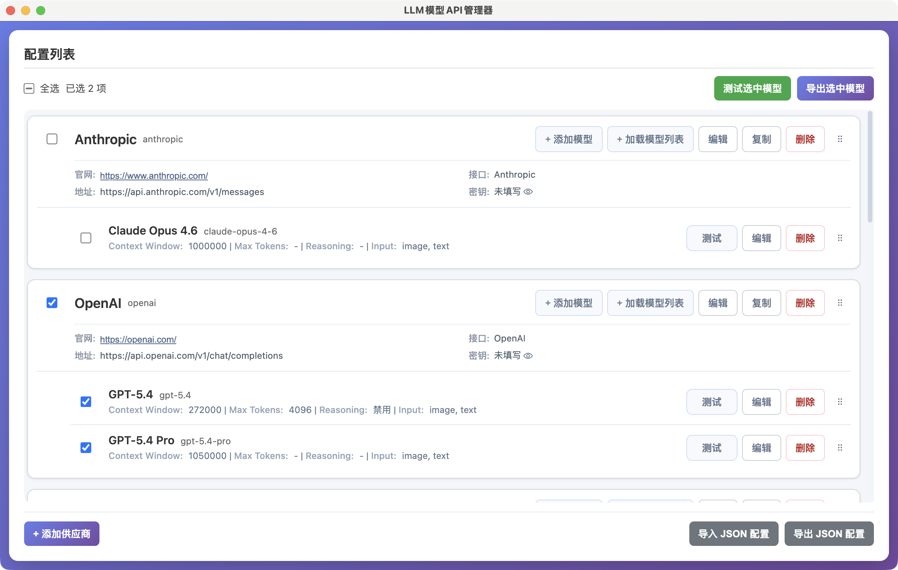
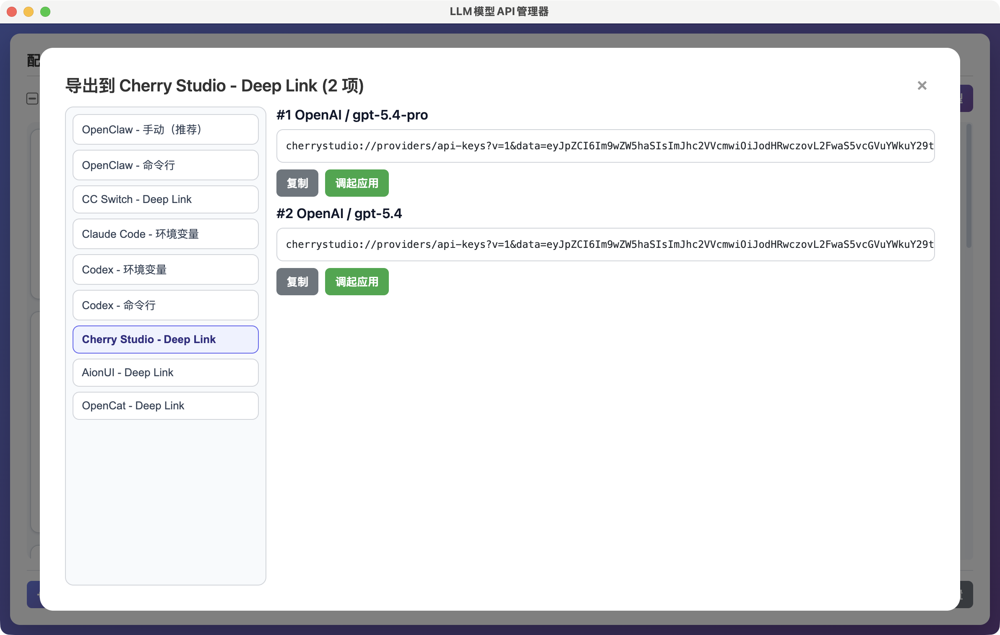

# LLM 模型 API 管理器

Electron 桌面应用，用于集中管理 LLM 供应商与模型配置：支持 OpenAI 兼容与 Anthropic 两类接口，可测试连通性、探测模型参数，并将选中模型导出到多种常用 AI 客户端。配置保存在本机，可离线使用。

## 主要功能

- 多供应商、多模型管理：新增、编辑、删除、复制、折叠/展开、拖拽排序
- 模型测试：单模型测试与批量「测试选中模型」
- 模型参数：支持记录与探测 Context Window、Max Tokens 等（见 `ModelParams`）
- 从远端拉取模型列表（按供应商配置请求，结果在弹窗中展示与选用）
- 导出：勾选模型后导出为多种目标格式（环境变量、命令行、Deep Link、Markdown 等），导出内容支持语法高亮预览
- 配置备份与迁移：右下角「导出 JSON」「导入 JSON」
- 本地持久化：配置写入 Electron `userData` 目录下的 `configs.json`





## 下载安装包

前往 [GitHub Releases](https://github.com/jzj1993/llm-model-manager/releases) 下载对应平台安装包。

## 使用流程

1. 点击 **添加供应商**，填写供应商标识、Base URL、Endpoint，按需填写 API Key、官网；接口类型在 OpenAI 兼容与 Anthropic 之间选择。
2. 在供应商下添加模型，可使用预设快速填充。
3. 对单个模型执行测试，或在顶部勾选后点击 **测试选中模型**。
4. 需要导出到其他工具时，勾选模型后点击 **导出选中模型**，选择目标格式后复制内容，或按提示在终端/浏览器中执行。
5. 备份或迁移配置：使用 **导出 JSON** / **导入 JSON**。
6. 列表较长时可用 **折叠全部** / **展开全部**；用 **全选** 快速选中全部模型。

## JSON 导入冲突处理

当当前已有配置且导入文件也包含配置时，应用会提示：

- **合并导入**：按 `provider.id` 合并；同一 Provider 内按 `model.id` 合并（同 ID 以导入内容为准）
- **覆盖导入**：用导入文件替换当前全部配置
- **取消**：不执行本次导入

## 支持导出的应用 / 形式

- OpenClaw（手动 / 命令行）
- CC Switch（Deep Link）
- Claude Code（环境变量）
- Codex（环境变量 / 命令行）
- Cherry Studio（Deep Link）
- AionUI（Deep Link）
- OpenCat（Deep Link）

## 数据与安全

- 配置保存在本地（`userData` 下的 `configs.json`）
- API Key 仅用于本机发起的请求与生成导出内容，应用不会将密钥主动上传到第三方服务
- 执行命令行类导出前请自行备份目标配置文件，避免误覆盖

## 说明

本项目在开发过程中使用 AI 辅助编写，未经过完整回归测试。若发现问题，欢迎提交 [Issue](https://github.com/jzj1993/llm-model-manager/issues) 或 [PR](https://github.com/jzj1993/llm-model-manager/pulls)。

## 本地开发

### 技术栈

- **运行时：** Electron（主进程 + 预加载脚本）
- **构建：** [electron-vite](https://electron-vite.org/)，输出至 `dist/`
- **界面：** React 19、TypeScript、Tailwind CSS
- **组件：** Radix UI 对话框 / 气泡 / 提示等，配合 `class-variance-authority`、`tailwind-merge`
- **交互：** `@dnd-kit` 实现供应商与模型的拖拽排序
- **主进程能力：** 通过 IPC 读写配置、HTTP 探测、打开外链、在终端执行命令、在浏览器中执行脚本等（通道定义见 `src/shared/ipc.ts`）

### 前置要求

- Node.js ≥ 20
- npm

### 安装

```bash
npm install
```

### 启动

```bash
npm start
```

（预览构建产物，开发前需先 `npm run build`。）

### 开发模式（热重载）

```bash
npm run dev
```

### 文档

- Harness 自动化测试：[docs/HARNESS.md](docs/HARNESS.md)

### 发布桌面安装包（GitHub Release）

已配置 `electron-vite` + `electron-builder` + GitHub Actions：

- 工作流：`.github/workflows/release.yml`
- 触发：推送版本标签（如 `v1.1.5`，需与 `package.json` 中 `version` 一致），或手动 `workflow_dispatch`
- 流程：`npm run build` 生成 `dist` → `electron-builder` 打包并上传 Release 资产
- 目标：`macOS`（dmg、zip）、`Windows`（nsis、portable）、`Linux`（AppImage、tar.gz）

本地打包示例：

```bash
npm run dist
npm run dist:mac
npm run dist:win
npm run dist:linux
```

发版前建议本地执行 `npm run build` 确认通过。

## 许可证

MIT
