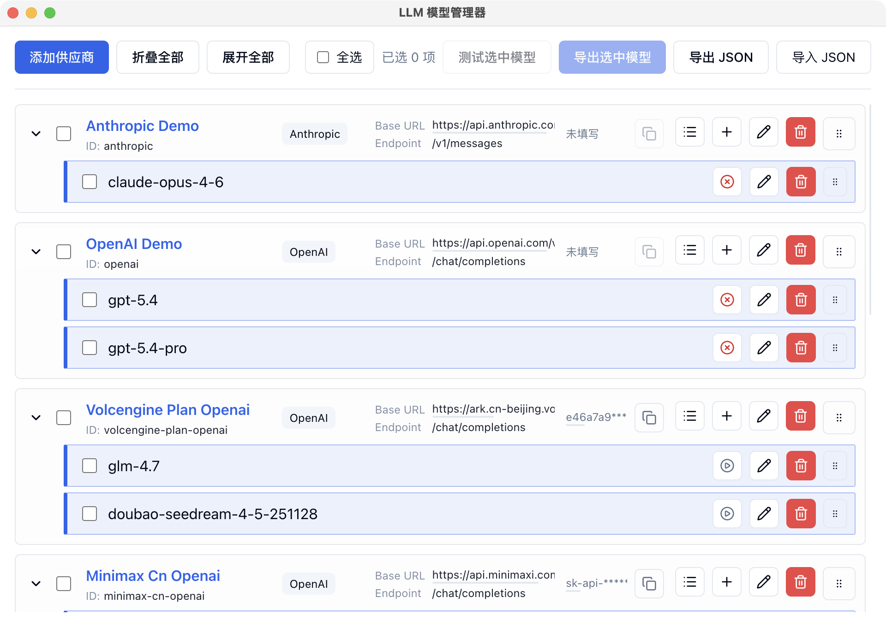
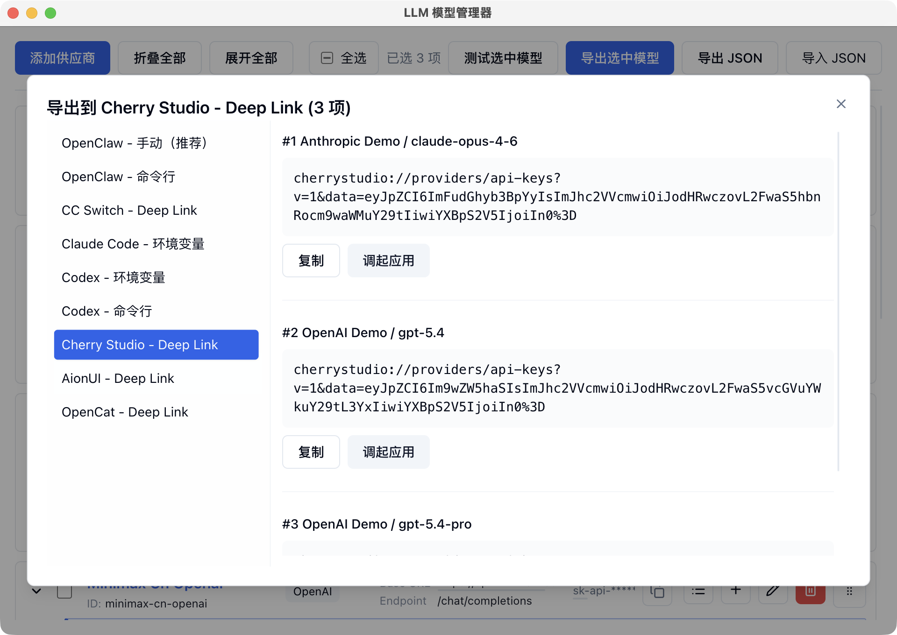

# LLM 模型 API 管理器

Electron 桌面应用，用于集中管理 LLM 供应商与模型配置：支持 OpenAI 兼容与 Anthropic 两类接口，可测试连通性、探测模型参数，并将选中模型导出到多种常用 AI 客户端。配置保存在本机，可离线使用。

## 主要功能

- 多供应商、多模型管理：新增、编辑、删除、折叠/展开、拖拽排序；列表内可复制 API Key
- 模型测试：单模型测试与批量「测试选中模型」
- 模型参数：支持记录与探测 Context Window、Max Tokens 等（见 `ModelParams`）
- 从远端拉取模型列表（按供应商配置请求，结果在弹窗中展示与选用）
- 导出：勾选模型后导出为多种目标格式（环境变量、命令行、Deep Link、Markdown 等），导出内容支持语法高亮预览
- 配置备份与迁移：右下角「导出 JSON」「导入 JSON」
- 本地持久化：配置写入 Electron `userData` 目录下的 `configs.json`





## 下载安装包

前往 [GitHub Releases](https://github.com/jzj1993/llm-model-manager/releases) 下载对应平台安装包。

## 使用流程

1. 点击 **添加供应商**，填写供应商标识、Base URL、Endpoint，按需填写 API Key、官网；接口类型在 OpenAI 兼容与 Anthropic 之间选择。
2. 在供应商下添加模型，可使用预设快速填充。
3. 对单个模型执行测试，或在顶部勾选后点击 **测试选中模型**。
4. 需要导出到其他工具时，勾选模型后点击 **导出选中模型**，选择目标格式后复制内容，或按提示在终端/浏览器中执行。
5. 备份或迁移配置：使用 **导出 JSON** / **导入 JSON**。
6. 列表较长时可用 **折叠全部** / **展开全部**；用 **全选** 快速选中全部模型。

## JSON 导入

导入 JSON 会解析文件（支持顶层数组或带 `providers` 字段的对象），经标准化后**替换**当前全部配置并保存。详细约定见 [specs/06-json-config-import-export.md](specs/06-json-config-import-export.md)。若后续产品增加「合并导入」等交互，以实现与文档更新为准。

## 支持导出的应用 / 形式

- OpenClaw（手动 / 命令行）
- CC Switch（Deep Link）
- Claude Code（环境变量）
- Codex（环境变量 / 命令行）
- Cherry Studio（Deep Link）
- AionUI（Deep Link）
- OpenCat（Deep Link）

## 数据与安全

- 配置保存在本地（`userData` 下的 `configs.json`）
- API Key 仅用于本机发起的请求与生成导出内容，应用不会将密钥主动上传到第三方服务
- 执行命令行类导出前请自行备份目标配置文件，避免误覆盖

## 说明

本项目在开发过程中使用 AI 辅助编写，未经过完整回归测试。若发现问题，欢迎提交 [Issue](https://github.com/jzj1993/llm-model-manager/issues) 或 [PR](https://github.com/jzj1993/llm-model-manager/pulls)。

## 本地开发

> 约束：本仓库以 `specs/` 作为**产品行为的唯一真源（source of truth）**。任何功能、交互、导出格式、边界条件的变更，必须同步更新 Specs；否则视为变更未完成。

### 技术栈

- **运行时：** Electron（主进程 + 预加载脚本）
- **构建：** [electron-vite](https://electron-vite.org/)，输出至 `dist/`
- **界面：** React 19、TypeScript、Tailwind CSS
- **组件：** Radix UI 对话框 / 气泡 / 提示等，配合 `class-variance-authority`、`tailwind-merge`
- **交互：** `@dnd-kit` 实现供应商与模型的拖拽排序
- **主进程能力：** 提供本地持久化、网络请求、打开外链、终端执行、浏览器脚本执行等桌面能力（具体行为以 `specs` 为准）

### 前置要求

- Node.js ≥ 24
- npm

### 安装

```bash
npm install
```

### 开发模式（推荐，热重载）

```bash
npm run dev
```

### 启动（预览构建产物）

当你希望用“构建后的产物”验证打包前行为时：

```bash
npm run build
npm start
```

### 构建与打包（本地）

```bash
npm run build
npm run dist
```

### 文档

- 产品行为说明（Specs 索引）：[specs/README.md](specs/README.md)
- Harness 自动化测试：[docs/HARNESS.md](docs/HARNESS.md)

### 变更规范（必须遵守）

当你修改任何产品行为（包括但不限于：表单自动填充、导入/导出规则、测试判定、远端模型列表映射、外部动作确认策略、UI 禁用态/文案/状态机），必须同时完成以下事项：

- **更新 Specs**：修改或新增对应的 `specs/*.md`，确保规则、触发点、边界条件与验收口径同步。
- **更新索引与交叉引用**：若新增/拆分文档，更新 `specs/README.md` 的文档地图与引用。
- **对齐对外文档**：若用户可见流程变化，更新本 `README.md` 的“使用流程 / JSON 导入 / 支持导出应用”等章节。

推荐在提交前自检：

- 变更涉及 Provider/Model/Preset/Selection/Export 语义时，Specs 是否能让新同事“只看文档就实现同等行为”？
- 是否新增了用户可见的边界条件或风险（例如外部执行）但未写入 Specs？
- 是否出现“实现已变但 Specs 仍描述旧行为”的不一致？

### 发布桌面安装包（GitHub Release）

仓库已配置 `.github/workflows/release.yml`。

发布步骤：

1. 修改 [package.json](package.json) 中的 `version`，例如改为 `1.2.1`。
2. 提交并推送该版本变更。
3. 创建与版本一致的 Git 标签，格式必须为 `vX.Y.Z`，例如：

```bash
git tag -a v1.2.1 -m "release: v1.2.1"
git push origin main
git push origin v1.2.1
```

推送标签后，GitHub Actions 会自动构建并发布以下安装包到 GitHub Releases：

- macOS: `dmg`, `zip`
- Windows: `nsis`, `portable`
- Linux: `AppImage`, `tar.gz`

发版前建议先执行：

```bash
npm run build
```

说明：`npm run dist` / `dist:mac` / `dist:win` / `dist:linux` 仅用于本地打包测试，不会上传 GitHub Release。

## 许可证

MIT
